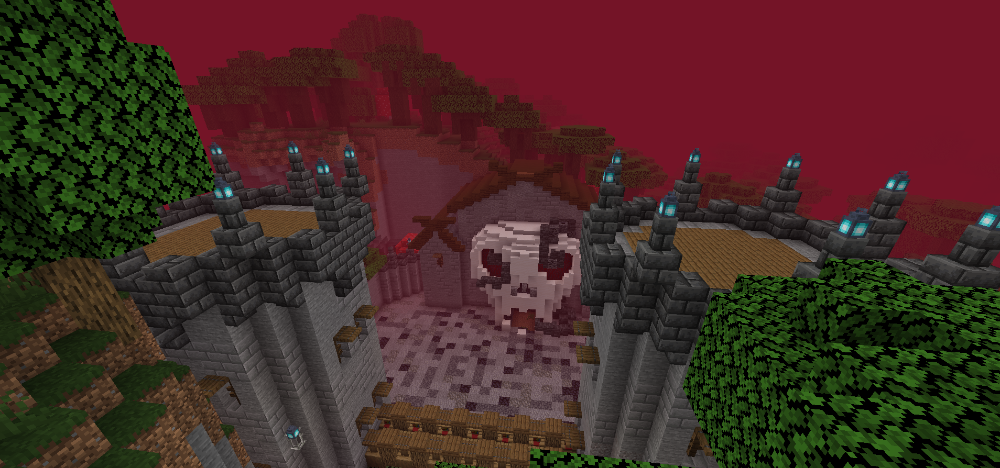

# Yggdrasil Mod

Ce mod Minecraft introduit des éléments de la mythologie nordique, mettant en vedette l'Arbre Yggdrasil et ses dimensions associées.

## Description

Dans ce mod, les joueurs ont pour objectif de trouver l'Arbre Yggdrasil, qui est le centre de l'univers selon la mythologie nordique. Cet arbre contient trois portails menant à différentes dimensions :

1. **Jotunheim**: Une dimension mystérieuse où les joueurs peuvent découvrir un nouveau minerai utilisé pour fabriquer une gemme spéciale.

1. **Helheim**: Une dimension cauchemardesque où les joueurs doivent affronter le redoutable Raton-laveur, une créature terrifiante qui garde une gemme essentielle.

1. **Valhöll**: Le paradis des guerriers tombés au combat, une dimension paisible et magnifique où les joueurs peuvent enfin trouver la paix.

## Fonctionnalités

- Exploration de l'Arbre Yggdrasil et de ses branches.
- Combat contre des créatures mythiques nordiques telles que le Raton-laveur.
- Découverte de nouveaux minerais et objets uniques dans chaque dimension.
- Progression à travers les dimensions en collectant des gemmes spéciales.
- Un gameplay immersif inspiré de la mythologie nordique.

## Installation

1. Assurez-vous d'avoir [Fabric Loader](https://fabricmc.net/use/) installé.
2. Téléchargez la dernière version du mod depuis la section Releases.
3. Placez le fichier JAR téléchargé dans le dossier "mods" de votre installation Minecraft.

## Utilisation

1. Lancez Minecraft avec le profil Fabric Loader.
2. Commencez une nouvelle partie ou chargez une partie existante.
3. Explorez le monde pour trouver l'Arbre Yggdrasil.
4. Traversez les dimensions en activant les portails et en collectant les gemmes nécessaires.

## Contributions

Les contributions sont les bienvenues ! Si vous souhaitez contribuer à ce mod, veuillez soumettre une Pull Request sur GitHub.

## Licence

Ce mod est distribué sous la licence MIT. Voir le fichier `LICENSE` pour plus de détails.

---

© 2024
